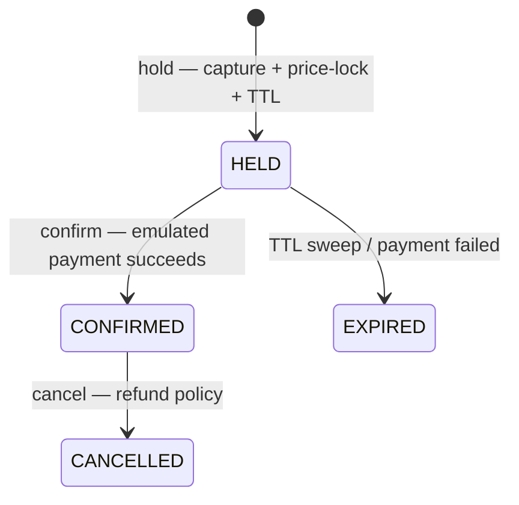
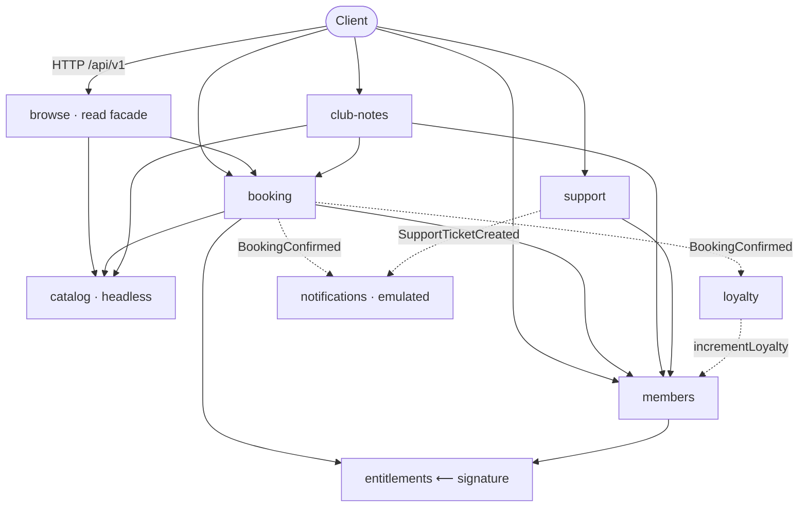
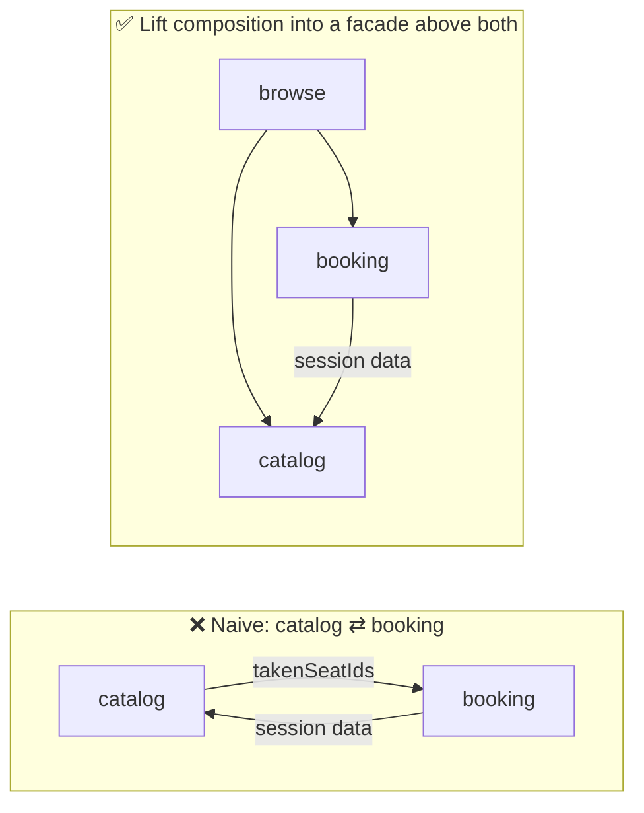

# Cinemafia — Modular Monolith

A NestJS backend for **Cinemafia**, a movie‑fan‑club cinema network, built as a
**Modular Monolith**: one deployment and one database, but the code is split into
**domain modules with explicit boundaries** that talk only through each other's
**public facade** — never by reaching into another module's tables.

This repository is one implementation in a portfolio series that builds the **same
domain across several server‑side architectures**, so the architectural
differences stand out against an unchanging domain. It is project **#2**, and it
**conforms to the REST contract frozen by the Layered baseline (#1)** — same
endpoints, same DTO shapes. Architecture changes how the code is *organized*, not
the external contract.

> 👉 Compare with the baseline: **[Cinemafia — Layered](https://github.com/vadim-stepanov/cinemafia-layered)** (#1).
> See **[Layered vs Modular](#layered-1-vs-modular-2-the-same-feature-two-ways)** below for the concrete contrast.

> Runs locally only; it is never deployed. The domain is a vehicle for
> demonstrating backend architecture, not a real business.

---

## The domain

Cinemafia is framed as a **club for film fans**, not a ticket marketplace. Two
ideas drive the whole model:

- **Curated sessions, not single screenings.** A *session* bundles one or more
  movies into a themed event — a genre block, a mixed combo, a marathon, a
  director's cut, a special event with guests, or a premiere.
- **Two independent axes of status.** Paid **membership** is the entry ticket to
  the club (tiers `BASIC` / `PLUS` / `PRO`, with a lifecycle and a guest quota).
  Earned **loyalty degree** is your standing in the inner circle — it accumulates
  from confirmed bookings and unlocks gated sessions and a larger guest quota. You
  *pay* to get in; you *earn* your way up.

The **signature domain logic** is resolving **entitlements** from
`(membership tier, loyalty degree)` — the effective guest quota, the member
discount, and whether a member may access a gated session.

### Booking lifecycle

A booking captures seats (by tier) or a whole group cabin, holds them under a TTL,
and then moves through a small state machine:



Seat and cabin **contention** ("two people grab the last seat") is resolved in the
database: partial unique indexes guarantee a resource is held or confirmed by at
most one active booking per session.

---

## What "Modular Monolith" means here

One deployment, one PostgreSQL database — but the code is cut into **domain
modules**, each of which:

- **owns its own tables** and is the *only* code that reads or writes them;
- exposes **only a public facade service** (in the NestJS module's `exports`) —
  its controller, repository and internal DTOs stay unexported;
- reaches other modules **through their facade** (a synchronous call when it needs
  an immediate result) or **through an in‑process domain event** (when the
  relationship is reactive). Never by importing another module's internals or
  querying its tables.

This is the deliberate step up from the Layered baseline (#1), where “modules”
were just folders and any service could read any table. Here the boundary is real:
the schema even **drops cross‑module foreign keys** so a module *cannot* navigate
into another's data through the ORM — references across modules are by id, and the
data is fetched through the owning module's facade.

### Module map

Solid arrows are synchronous facade calls (a Nest module `imports` another and
injects its service); dashed arrows are in‑process domain events. **Every arrow
points one way — the module graph is acyclic.**



- **`entitlements`** holds the signature resolution `(tier, degree) → entitlements`
  as its own module node; `members` and `booking` both depend on it.
- **`booking`** owns the booking aggregate and the transaction boundary
  (`prisma.$transaction`); it reads session/seat data from `catalog`, the member
  profile from `members`, and the signature from `entitlements` — all via facades.
- **`loyalty`** owns no tables: it reacts to `BookingConfirmed` and accrues rank by
  calling `members.incrementLoyalty`, never by writing the members table itself.
- **`catalog` is headless** and **`browse` is a thin composition facade** — see
  the next section for why.

---

## Layered (#1) vs Modular (#2): the same feature, two ways

The clearest place to see the difference is one field: `takenSeatIds` on
`GET /sessions/:id` — which seats of a session are currently taken. Seats belong
to **catalog**; whether a seat is taken lives in **booking**'s `booking_seats`
table.

**In #1 (Layered)**, catalog simply queried booking's table:

```ts
// Layered: catalog reads another module's table directly
this.prisma.bookingSeat.findMany({ where: { sessionId, active: true } });
```

Fast, and nothing stops it — which is exactly how a Layered app slides into a
big ball of mud.

**In #2 (Modular)**, catalog may not touch `booking_seats`. It must ask booking's
facade — `bookingService.getTakenSeatIds(sessionId)`. But booking, in turn, needs
catalog's session/pricing data at hold time. Drawing the boundary **surfaces a
would‑be cycle**:



The fix is **not** `forwardRef` (a cycle hidden by the framework) and **not**
copying booking's state into a catalog read model (two sources of truth). The
composition of *catalog data + booking availability* is its own responsibility, so
it is lifted into a thin module **above** both leaves:

- **`catalog` is headless** — it owns session/hall/seat data and exposes
  `CatalogService`, but has **no controller** and **no knowledge of booking**.
- **`booking → catalog`** stays a clean one‑way dependency (a booking is made
  *against* the catalog).
- **`browse`** is the only module that depends on **both**. It hosts the public
  `GET /sessions` and `GET /sessions/:id` and merges session detail with live
  availability from booking. It is the concrete “public API facade” the domain
  anticipates, and the seed of the BFF/gateway that grows in the microservices
  variant of the series.

So `catalog` and `booking` stay pure, acyclic leaves, `booking_seats` remains the
single source of truth, and there is no `forwardRef` anywhere in the codebase.

---

## Trade‑offs (the honest part)

- The boundaries are held by **discipline + Nest module encapsulation**, not by
  the type system — TypeScript would not stop you importing another module's
  internal class if you really tried. The schema's dropped cross‑module FKs make
  the data boundary structural, but the code boundary is a convention the modules
  agree to.
- Dropping cross‑module foreign keys trades the database's referential integrity
  *between* modules for application‑enforced integrity — the same trade real
  modular monoliths and bounded contexts make (and what foreshadows extracting
  services in #5).
- The domain is still **anemic** and coupled to Prisma/Nest — there is no
  framework‑independent domain core (that is the Hexagonal project, #3) and no
  rich aggregates/use‑cases (Clean + DDD, #4). #2's contribution is **module
  encapsulation and data ownership**, nothing more.

---

## Project structure

```
src/
├── common/                # config (zod), prisma, auth, payment, notifications,
│                          # events, health, exception filter  (no domain module)
└── modules/
    ├── catalog/           # movies, sessions, halls, seats, cabins  — headless
    ├── entitlements/      # (tier, degree) → entitlements  ← signature
    ├── members/           # /me profile, loyalty stat owner
    ├── booking/           # hold → confirm → cancel → expire (core)
    ├── browse/            # public /sessions read facade (catalog + availability)
    ├── loyalty/           # earned rank — reacts to BookingConfirmed, no tables
    ├── club-notes/        # members-only notes
    └── support/           # emulated support tickets
```

Each domain module follows the canonical NestJS layout
(`*.module.ts` / `*.controller.ts` / `*.service.ts` / `*.repository.ts` + `dto/`),
**but exports only its facade service** — the repository and internals stay
unexported. The Prisma schema is split by owning module under
[`prisma/schema/`](prisma/schema).

---

## Tech stack

TypeScript · NestJS 11 · Prisma 7 + PostgreSQL · Docker Compose · Vitest +
supertest · ESLint (flat) + Prettier. No Redis or message broker — in‑process
events, Postgres‑backed hold TTL and seat contention. (Those belong to the
distributed implementations in the series.)

---

## Getting started

Requires Node 24 (see `.nvmrc`) and Docker.

```bash
cp .env.example .env        # local config (Postgres on host port 5443)
docker compose up -d        # start PostgreSQL
npm install
npm run prisma:generate     # generate the Prisma client
npm run prisma:migrate      # apply migrations
npm run db:seed             # load demo data (optional, recommended)
npm run start:dev           # http://localhost:3000
```

- **Swagger UI:** http://localhost:3000/docs · **OpenAPI spec:** `/docs-json`
- **Health probe:** http://localhost:3000/api/health
- **Tests:** `npm test` (Vitest + supertest; needs Postgres running)

> The Docker Postgres runs on host port **5443** so this repo can run alongside
> its sibling implementations in the series without a port clash.

### Trying it out

All authenticated routes accept an emulated identity via the `X-User-Id` header
(or a `Bearer` token). The seed creates demo members you can act as:

| User           | Membership | Loyalty | Notes                          |
| -------------- | ---------- | ------- | ------------------------------ |
| `u-boss`       | PRO        | 8       | full access, biggest quota     |
| `u-capo`       | PLUS       | 4       | mid tier                       |
| `u-associate`  | BASIC      | 1       | entry tier                     |
| `u-rookie`     | —          | 0       | no membership                  |
| `u-lapsed`     | EXPIRED    | 2       | membership no longer active    |

```bash
curl localhost:3000/api/v1/sessions
curl localhost:3000/api/v1/me -H "X-User-Id: u-boss"
```

A ready‑made **Bruno collection** in [`/bruno`](bruno) walks the whole vertical
flow (browse → me → hold → confirm → notes → cancel → support). Open it with the
Bruno app or the VS Code Bruno extension and select the `local` environment.

It represents one booking's lifecycle, so it is **stateful**:

- The easiest way is Bruno's **Run** (collection runner) — it executes the
  requests in order, passes ids between them, and ends with `cancel`, which frees
  the seat, so you can run it again and again.
- Running requests **individually** also works: the read requests and `hold` are
  self‑sufficient (the `local` environment defaults to the seeded `demo-session` /
  `demo-seat`), while `confirm` / `cancel` need the `bookingId` produced by `hold`.
- The seed is a **full reset**: `npm run db:seed` (or `npm run db:reset`) wipes the
  domain tables and re‑inserts the same fixed demo dataset — it never accumulates
  duplicates. Run it whenever you want a clean slate (e.g. if a stale hold makes
  `hold` return `409`).

---

## API contract

This repository **conforms to** the canonical REST contract defined by the Layered
baseline (#1). The machine‑readable artifact is committed at
[`docs/openapi.json`](docs/openapi.json); the generated `/docs-json` is verified to
match it (same paths, operations and DTO schemas). Conventions: global prefix
`/api` with URI versioning (`/api/v1/...`); infra routes (`/api/health`) are
version‑neutral; money is integer cents; timestamps are ISO 8601; a single error
shape `{ statusCode, error, message, path, timestamp }`.

| Area     | Endpoints                                                            | Module |
| -------- | ------------------------------------------------------------------- | ------ |
| Catalog  | `GET /sessions`, `GET /sessions/:id`                                | browse → catalog + booking |
| Identity | `GET /me`                                                           | members → entitlements |
| Booking  | `POST /bookings/hold` · `/:id/confirm` · `/:id/cancel`, `GET /bookings`, `GET /bookings/:id` | booking |
| Club     | `GET/POST /sessions/:id/notes`                                      | club-notes |
| Support  | `POST /support`                                                     | support |

---

## Emulated boundaries

Peripheral mechanisms that are not the subject of the demo are **working proxies
that emulate behavior**, not dead stubs — plain Nest providers in `common/`, marked
as demo‑boundaries in the code:

- **Auth** — issues/decodes a token, or accepts an `X-User-Id` header. No
  passwords, OTP or sessions.
- **Payment** — a charge/refund gateway that simulates latency, a configurable
  failure rate, and idempotency by key.
- **Notifications** — logs the "delivery" instead of sending anything.

---

## Testing

- **Unit** on the core logic: entitlement resolution (tier × degree, expiry, caps,
  early‑access window), payment idempotency/refund, and loyalty accrual.
- **End‑to‑end** (supertest) on the canonical flow, the seat‑contention race,
  access gating, guest‑quota limits, payment failure, hold expiry, the
  `BookingConfirmed → loyalty` reaction, and the club‑notes / support contexts —
  asserting, for example, that `takenSeatIds` is composed from booking through the
  facade rather than read from a catalog table.

---

## Author

Vadim Stepanov — fullstack engineer.

- GitHub: [@vadim-stepanov](https://github.com/vadim-stepanov)
- LinkedIn: [linkedin.com/in/vadim-stepanov-98936150/](https://www.linkedin.com/in/vadim-stepanov-98936150/)
- Email: vadim.stepanov.mailbox@gmail.com

---

## License

MIT.
